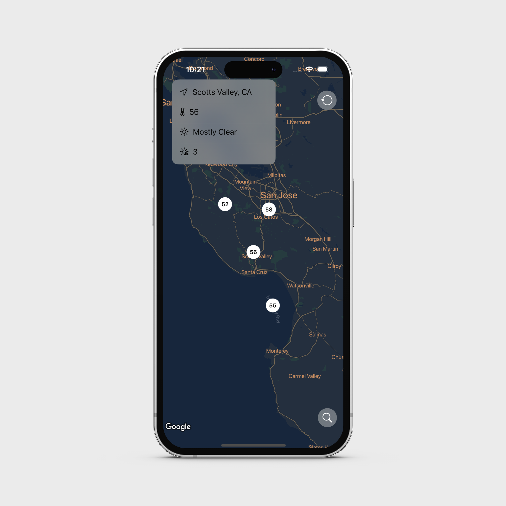

# Map Explore App

## Overview
The Map Explore App is a SwiftUI application that integrates Google Maps and WeatherKit, allowing users to interact with a map and receive real-time weather updates at any location with just a tap. 

## Demo


## Features
- **Google Maps Integration:** Interactive map interface with capabilities for zooming and panning.
- **Real-Time Weather Updates:** Tap anywhere on the map to get current weather details for that location.

## Getting Started

### Setup Instructions

1. **Clone the Repository**
   ```bash
   git clone https://github.com/yourusername/MapExploreApp.git
   ```

2. **Obtain a Google Maps API Key**
   - Visit the [Google Cloud Platform Console](https://console.cloud.google.com/).
   - Create a new project and enable the Google Maps SDK for iOS.
   - Get an API key to be used in your project.

3. **Configure the API Key in your Application**
   - Open the `AppDelegate.swift` file.
   - Replace `Your_Google_Map_API_Key` with your actual Google Maps API key.

4. **Install Dependencies**
   - Add the Google Maps SDK package to your project via Swift Package Manager.

5. **Run the Application**
   - Build and run the application in Xcode to see it in action.

## Usage
Once the app is running, you can interact with the map interface. Tap any location to view up-to-date weather information for that specific area.

## Contributing
Contributions are welcome! If you have suggestions or improvements, please fork the repository and submit a pull request.

